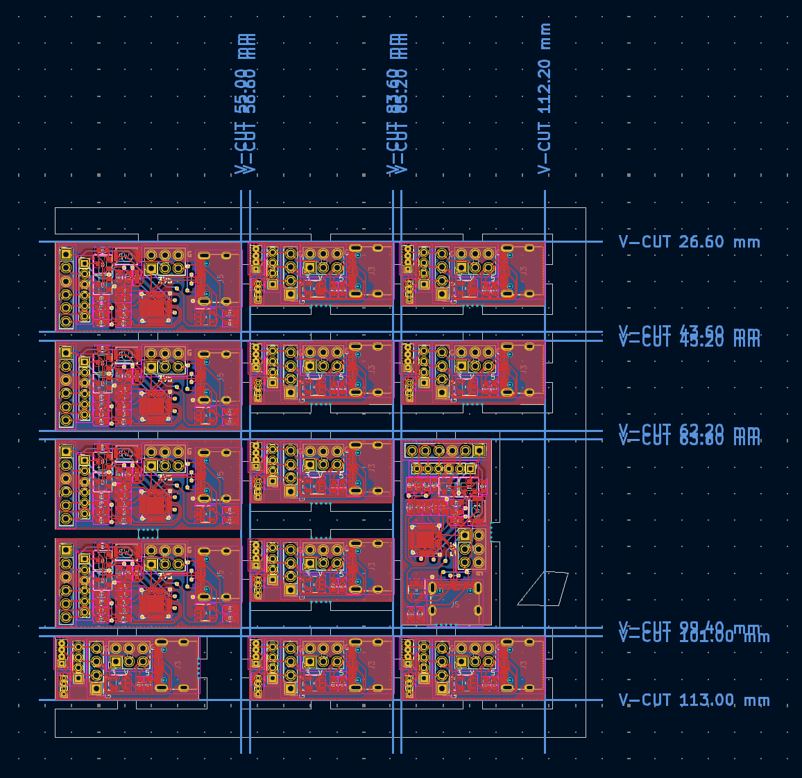
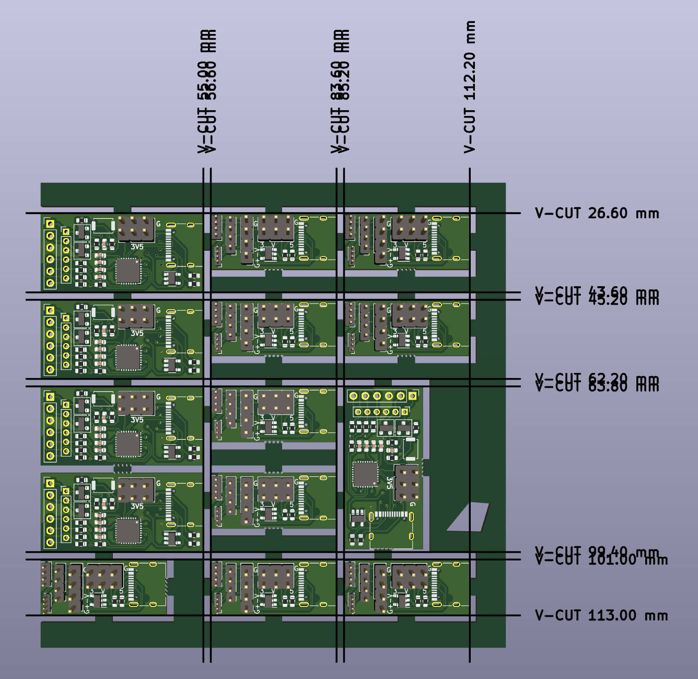
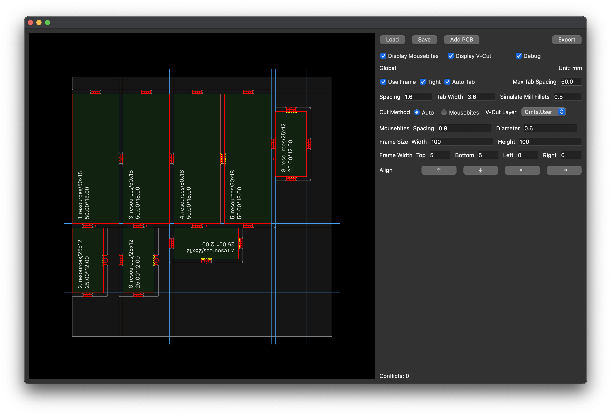

Tested with KiCad 7.0.10 and KiKit 1.5.1

# Installation
Currently I am using the python bundled with KiCad
```
PYTHON=/Applications/KiCad/KiCad.app/Contents/Frameworks/Python.framework/Versions/3.9/bin/python3.9

${PYTHON} -m venv --system-site-packages env
./env/bin/pip3 install -r requirements.txt

./env/bin/python3 kikit-ui.py
```

# Tight Frame + Auto Tab + Auto Cut

## Output

## 3D Output


# Tight Frame + Auto Tab + Mousebites


# Loose Frame + Auto Tab + Mousebites

## 3D Output


# Auto Tab
Tab position candidates is determined by PCB Edge / `max_tab_spacing`, prioritized by divided edge length (smaller first), and skipped if there is an nearby (distance < `max_tab_spacing/3`) cadidate with higher priority.

In the below image, small red dots are tab position candidates, bigger red circle are selected candidates, the two rectangles are two half-bridge tabs.


# ToDo
* Manual tabbing
* Arbitrary rotation