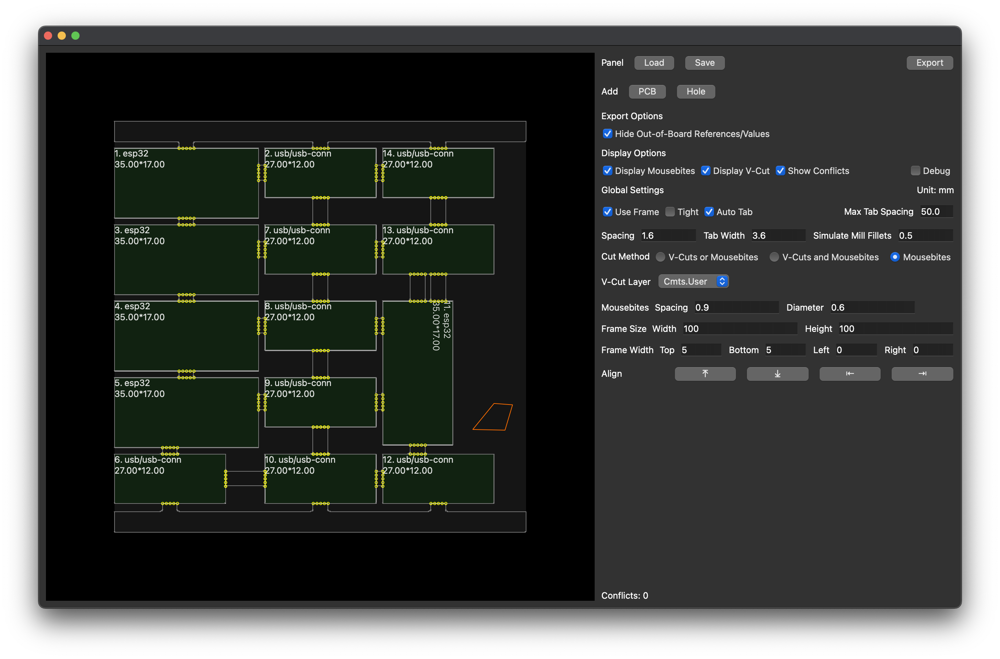

# Notice
You probably need to update the python executable path at the first line of ui.py

Tested with KiCad 7.0.10 and KiKit 1.5.1

# Tight Frame + Auto Tab + Auto Cut

## Output

## 3D Output

# Tight Frame + Auto Tab + Mousebites

# Loose Frame + Auto Tab + Mousebites

## 3D Output

# ToDo
* Manual tabbing
* Arbitrary rotation