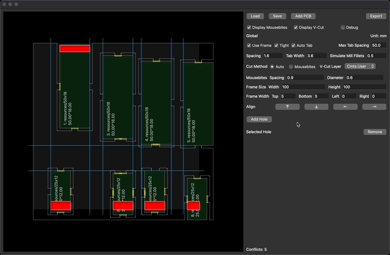
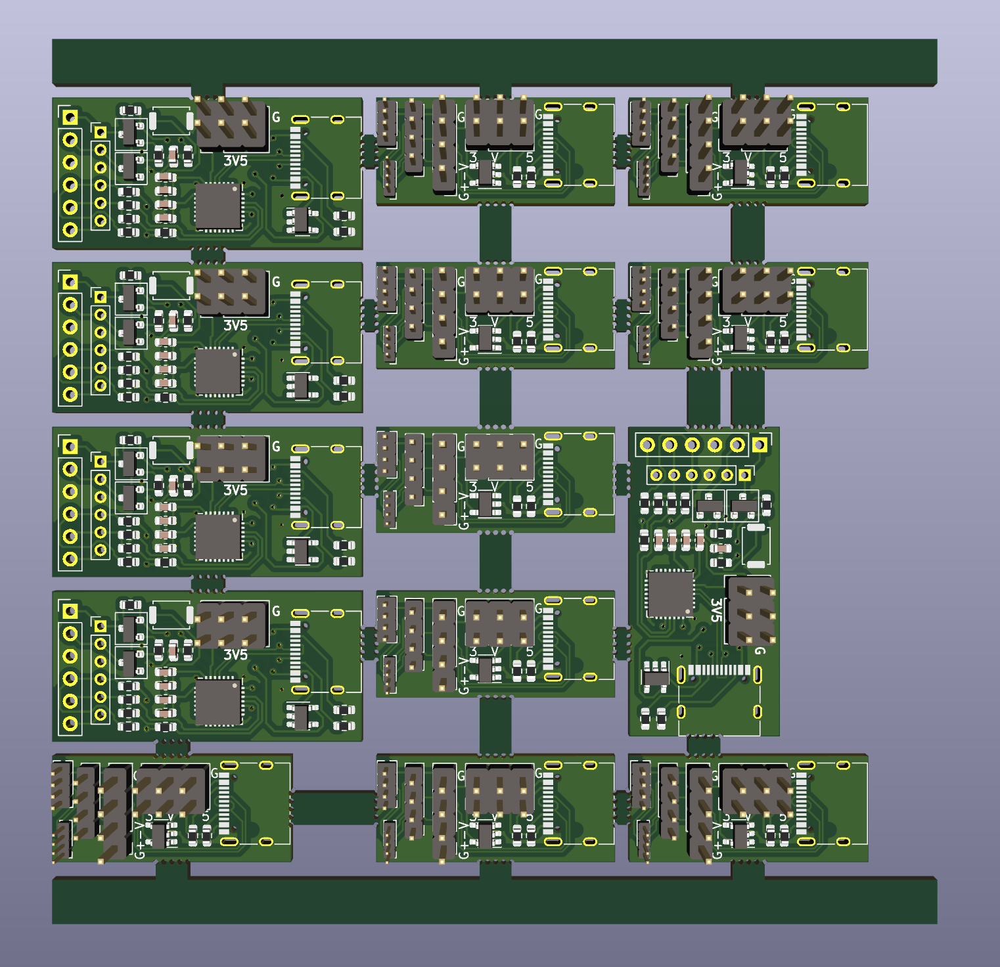

# GUI for KiKit Panelization

This project is built on top of [KiKit](https://github.com/yaqwsx/KiKit).

Tested with KiCad 7.0.10/8.0.4 and KiKit 1.6.0 (requires unreleased `e19408a1ae5e979115fc572deb480a768e291e6b` for arbitrary rotation)

# Installation
Make sure your python can import `pcbnew`
```
> python3 -c "import pcbnew; print(pcbnew._pcbnew)"
<module '_pcbnew' from '/usr/lib/python3/dist-packages/_pcbnew.so'>
```
On macOS, I have to use the python interpreter bundled with KiCAD
```
PYTHON=/Applications/KiCad/KiCad.app/Contents/Frameworks/Python.framework/Versions/Current/bin/python3
```

Create a virtual environment and install dependencies
```
${PYTHON} -m venv --system-site-packages env
./env/bin/pip3 install -r requirements.txt
```

Run
```
./env/bin/python3 kikit-ui.py
```

# Usage
```
# Just open it
./env/bin/python3 kikit-ui.py

# Start with PCB files
./env/bin/python3 kikit-ui.py a.kicad_pcb b.kicad_pcb...

# Load file
./env/bin/python3 kikit-ui.py a.kikit_pnl

# Headless export
./env/bin/python3 kikit-ui.py a.kikit_pnl out.kicad_pcb
```

# First PCBA (Mousebites)


# Global Aligment


# Per-PCB Aligment


# Substrate Hole


# Tight Frame + Auto Tab + V-Cuts *or* Mousebites

## Output

## 3D Output


# Tight Frame + Auto Tab + V-Cuts *and* Mousebites


# Loose Frame + Auto Tab + Mousebites

## 3D Output


# Auto Tab
Tab position candidates are determined by the PCB edge and max_tab_spacing, prioritized by divided edge length (smaller first), and skipped if there is a nearby candidate (distance < max_tab_spacing/3) with higher priority.

In the image below with debug mode on, small red dots are tab position candidates, larger red circles are selected candidates, and the two rectangles represent the two half-bridge tabs.


# ToDo
* Manual tabbing
